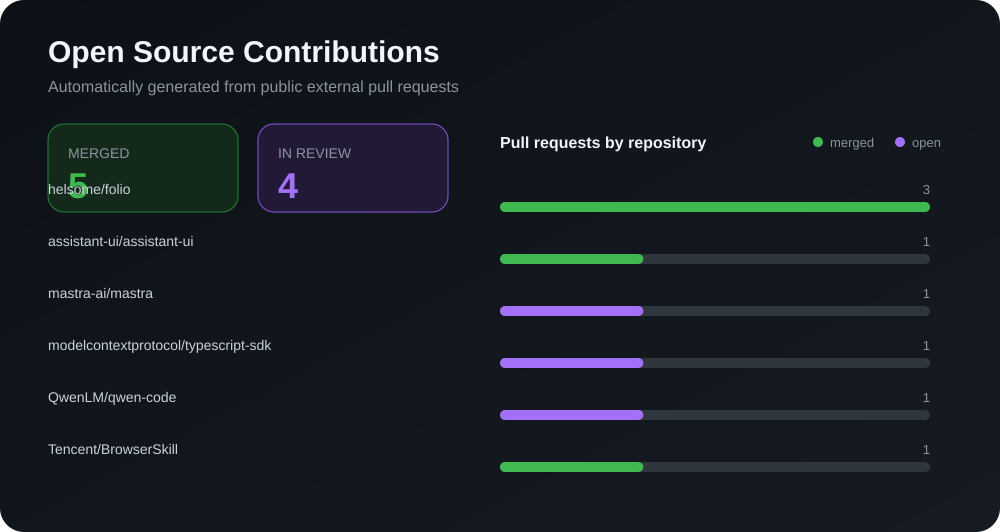

# Hey, I'm Sthreal 👋

**AI Agent / LLM Application Developer**

I contribute to open-source projects around agent runtimes, streaming,
reliability, MCP, and LLM tooling.

---

## What I Build

- ⚙️ **Agent Runtime** — lifecycle, cancellation, timeouts, retries, and resource cleanup
- 🔬 **Reliability** — race conditions, streaming correctness, and failure recovery
- 🔗 **LLM Tooling** — MCP, tool calling, structured output, and provider integration
- 📚 **RAG & Evidence** — retrieval quality, provenance, and citation traceability

<!-- OPEN_SOURCE_CONTRIBUTIONS:START -->
## Open Source Contributions

> Automatically updated daily · 5 merged · 4 in review

### Merged Pull Requests

| Project | Contribution | PR |
|---|---|---|
| [helsome/folio](https://github.com/helsome/folio) | Removed a provider timeout abort-listener leak | [#186](https://github.com/helsome/folio/pull/186) |
| [helsome/folio](https://github.com/helsome/folio) | Prevented uncooperative capabilities from bypassing execution timeouts | [#183](https://github.com/helsome/folio/pull/183) |
| [assistant-ui/assistant-ui](https://github.com/assistant-ui/assistant-ui) | Fixed duplicate `assistant-cloud` instances by reusing the host `ai` peer | [#8071](https://github.com/assistant-ui/assistant-ui/pull/8071) |
| [Tencent/BrowserSkill](https://github.com/Tencent/BrowserSkill) | Scoped `doctor` skill status to the bundled CLI version | [#329](https://github.com/Tencent/BrowserSkill/pull/329) |
| [helsome/folio](https://github.com/helsome/folio) | Enforced wall-clock run budgets while an agent event stream is silent | [#85](https://github.com/helsome/folio/pull/85) |

### Pull Requests In Review

| Project | Contribution | PR |
|---|---|---|
| [TencentCloud/octop-harness](https://github.com/TencentCloud/octop-harness) | Avoided cross-context session-header resets in streamed agents | [#10](https://github.com/TencentCloud/octop-harness/pull/10) |
| [modelcontextprotocol/typescript-sdk](https://github.com/modelcontextprotocol/typescript-sdk) | Updated `eventsource-parser` for large SSE responses | [#2846](https://github.com/modelcontextprotocol/typescript-sdk/pull/2846) |
| [mastra-ai/mastra](https://github.com/mastra-ai/mastra) | Coordinated Docker termination settlement metadata | [#24477](https://github.com/mastra-ai/mastra/pull/24477) |
| [QwenLM/qwen-code](https://github.com/QwenLM/qwen-code) | Preserved MCP OAuth registration URL during discovery | [#12233](https://github.com/QwenLM/qwen-code/pull/12233) |
<!-- OPEN_SOURCE_CONTRIBUTIONS:END -->

## Tech Stack

  
  
  
  
   
  
  
  
  

## Contribution Dashboard

  

## Focus Areas

- Agent Runtime and lifecycle reliability
- Streaming and cancellation correctness
- MCP and LLM tool integration
- Timeout, retry, and resource-leak prevention
- TypeScript, Node.js, React, and Python
